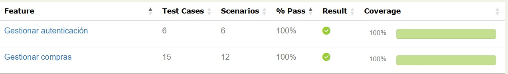
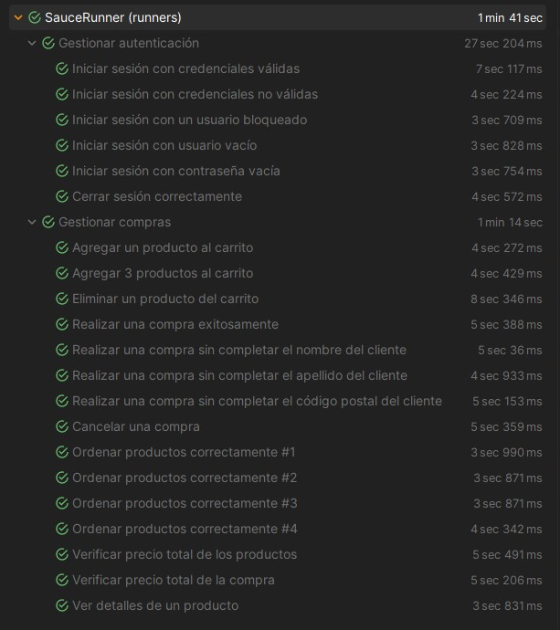

# 🧪 Proyecto de Automatización de Pruebas Web - SauceDemo - Escuela Testing

---

## 📊 Resumen de Resultados
- **Total de escenarios:** 18
- **Total de casos de prueba analizados:** 21
- **Casos exitosos:** 21

---

## 🛠️ Requisitos para Ejecutar el Proyecto

- ☕ Java 17 (recomendado) o superior
- 📦 Maven 3.11.0 (recomendado) o superior
- 🌐 Navegador (Chrome recomendado)

---

## 📸 Evidencia del Reporte de Pruebas





### Ubicación del reporte de pruebas
```
target/site/index.html
```
Si no encuentra el archivo `index.html` del reporte de las pruebas luego de ejecutarlas, ejecutar el siguiente comando:
```
mvn serenity:aggregate
```

---


## 📂 Features

### 🔐 Gestionar autenticación
- Iniciar sesión con credenciales válidas.
- Iniciar sesión con credenciales no válidas.
- Iniciar sesión con un usuario bloqueado.
- Iniciar sesión con usuario vacío.
- Iniciar sesión con contraseña vacía.
- Cerrar sesión corectamente.

---

### 🛒 Gestionar compras
- Agregar un producto al carrito.
- Agregar 3 productos al carrito.
- Eliminar un producto del carrito.
- Realizar una compra exitosamente.
- Realizar una compra sin completar el nombre del cliente.
- Realizar una compra sin completar el apellido del cliente.
- Realizar una compra sin completar el código postal del cliente.
- Cancelar una compra.
- Ordenar productos correctamente (nombre y precio - ascendente y descendente).
- Verificar precio total de los productos.
- Verificar precio total de la compra.
- Ver detalles de un producto.

---

## ▶️ Ejecución de las Pruebas

### 💻 Ejecución mediante Línea de Comandos

#### 🔁 Ejecutar todas las pruebas
```
mvn clean verify
```
ó
```
mvn clean verify -Dcucumber.filter.tags="@regression"
```

#### 🐞 Debug – Ejecutar pruebas aisladas
1. Agregar el tag `@debug` a los escenarios o features que se deseen ejecutar.
2. Ejecutar el siguiente comando:
```
mvn clean verify -Dcucumber.filter.tags="@debug"
```
#### 🛒 Shopping - Ejecutar las pruebas de la feature Shopping
```
mvn clean verify -Dcucumber.filter.tags="@shopping"
```
#### 🔐 authentication - Ejecutar las pruebas de la feature Authentication
```
mvn clean verify -Dcucumber.filter.tags="@authentication"
```

---

### 🧩 Ejecución desde Clases Java

#### 🔁 Regresión – Ejecutar todas las pruebas
1. Ubicar la clase `SauceRunner.java`.
2. Clic derecho sobre la clase.
3. Seleccionar **Run 'SauceRunner'**.
